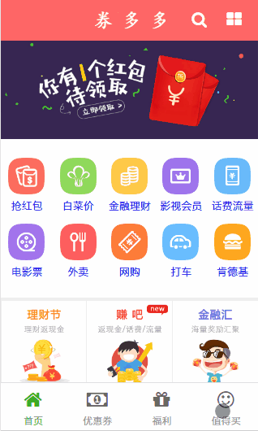

# 券多多优惠券
* 服务端node+koa2+mysql客户端提供RESTful接口。  
* 客户端主要分为移动端跟pc管理后端两个版本。
* 移动端UI主要基于weui框架，使用zepto以及swiper组件进行构建。
* 通过发送Ajax请求，实现了注册登录，列表展示，分类展示等功能。
* Pc管理后端基于boostrap框架，实现了用户，分类，信息列表等模块的增删改查。 
    
      

